# Relatório da Atividade 2 - Introdução a Linux usando Docker no Windows

| Disciplina | Docente | Discente | Data |
| :--------: | :-----: | :------: | :--: |
| Sistemas Operacionais | Leonardo A. Minora | João Vitor B. da Silva | 20/05/2025 |

 

## Objetivo da Atividade

> Realizar exercícios práticos com comandos básicos do Linux em um contêiner Docker baseado no Fedora, buscando entender o funcionamento e sintaxe no prompt de comando do Sistema Operacional Linux em uma máquina.

 

## Etapa 1 - Inicializando Container Fedora e Aprendendo Navegação Básica

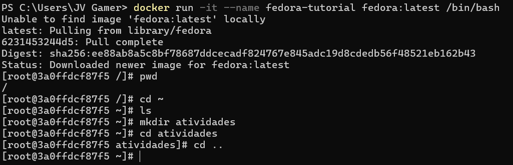

* Por meio do comando `docker run -it --name fedora-tutorial fedora:latest /bin/bash` o container usando a imagem do Fedora com o nome `fedora-tutorial` é criado.
* Assim que é criado o container é aberto no modo interativo `-it`.
* A primeira linha do `bash` do container Fedora contem o comando `pwd` usado para verificar o diretorio atual. A resposta fornecida é `/`, ou seja, o diretório raiz.
* Na segunda linha do `bash` contem o comando `cd ~` usado para entrar no diretório do usuário.
* Na terceira linha do `bash` é verificado se o diretório atual possui arquivos ou pastas. Não há retorno, pois está vazio.
* Na quarta linha do `bash` é criado uma pasta com o nome de atividades usando o comando `mkdir atividades`.
* Na quinta linha e sexta linha do `bash` contêm os comandos para entra na pasta crianda anteriomente `cd atividades` e para sair dessa pasta `cd ..`.

 

## Etapa 2 - Manipulando Arquivos

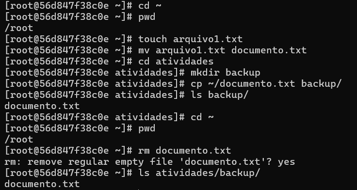

* Na primeira e na segunda linha do `bash` contêm os comandos para entrar na pasta do usuário `cd ~` e de verificar se o diretório atual é do usuário `pwd`. A resposta é `/root`, ou seja, o diretório atual é o do superusuário ou usuário administrador.
* Na terceira e na quarta linha do `bash` contêm os comandos para criar um arquivo de nome arquivo1.txt `touch arquivo1.txt` e para renomear esse arquivo para documento.txt `mv arquivo1.txt documento.txt`.
* Na quinta linha do `bash` contem o comando para entra no diretório atividades `cd atividades`.
* Dentro do diretório atividades na sexta, na setima e na oitava linha do `bash` é criado uma nova pasta de nome backup `mkdir backup`, em seguida é copiado o arquivo documento.txt para a nova pasta `cp ~/documento.txt backup/` e verficado quais arquivo estão dentro da pasta backup `ls backup/`. A resposta fornecida é o documento.txt que foi copiado para dentro da pasta.
* Na nona e na decima linha do `bash` contêm os comandos para voltar para pasta do usuário `cd ~` e de verificar se o diretório atual é do usuário `pwd`. A resposta é `/root`, ou seja, o diretório atual é o do superusuário ou usuário administrador.
* Na decima primeira e decima segunda linha do `bash` contêm os comandos para remover o arquivo documento.txt do diretório atual `rm documento.txt` e em seguida a verificação se a pasta backup possui arquivos `ls atividades/backup/`. A resposta é o documento.txt copiado para a pasta, dessa forma é mostrado que os documentos `documento.txt` são distintos.

 

### Arvore de Estutura de Diretório do Container usando `tree`
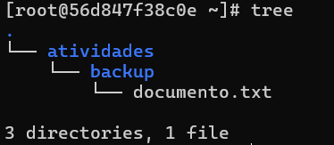

* Ao todo o container possui três diretórios: `.` , `atividades` e `backup` e apenas um arquivo: `documento.txt` localizado dentro do diretório `backup`.

 

## Etapa 3 - Gerenciamento de Pacotes

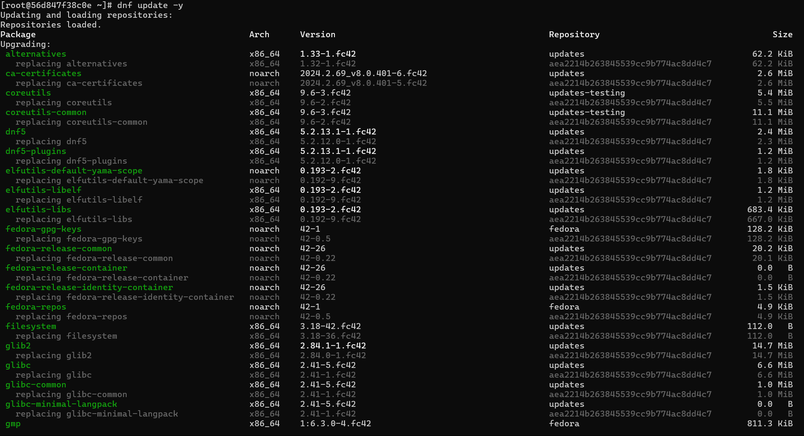
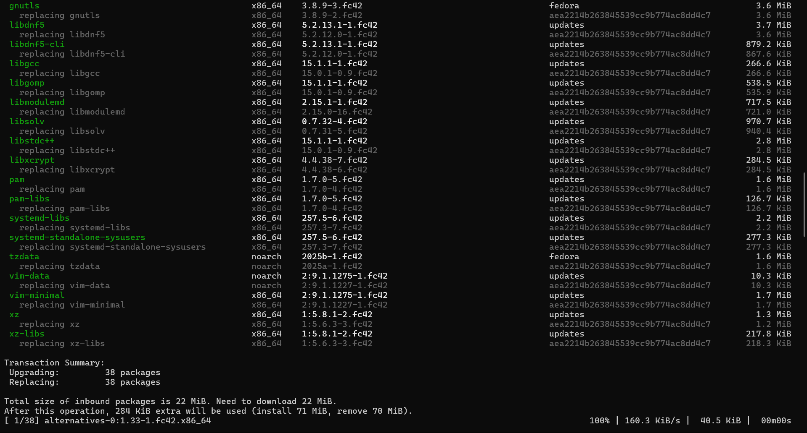
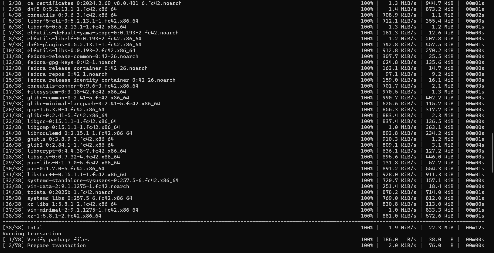
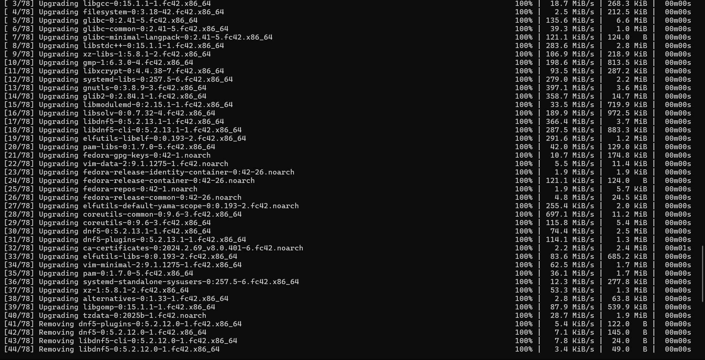
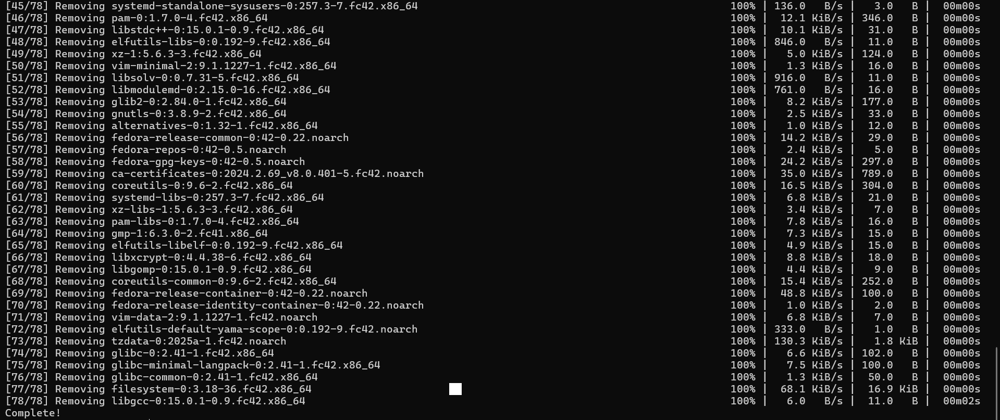

* Atualização da lista de pacotes usando o comando `dnf update -y`.

 

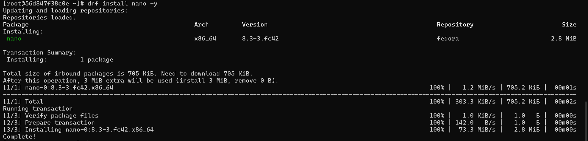
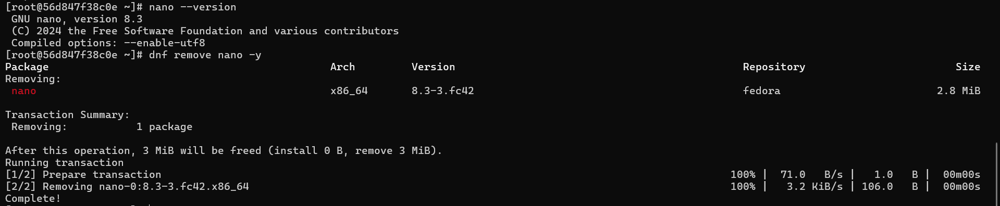

* Instalando o pacote de edição de texto nano usando o comando `dnf install nano -y`, verificando sua versão com `nano --version` e excluindo o pacote com `dnf remove nano -y`.

 

## Etapa 4 - Permissão de Arquivos

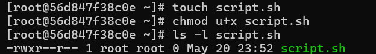

* Na primeira linha do `bash` contem o comando para a criação de uma arquivo de script chamado script `touch script.sh`.
* Na segunda linha do `bash` contem o comando para dar permissão ao usuário dono do arquivo `chmod u+x script.sh`. Dessa forma o usuário possui total permissão de execução do arquivo `script.sh`.
* Na terceira linha do `bash` contem o comando para verificar as permissões do arquivo `script.sh` `ls -l script.sh`. A resposta informa que o usuário root possui permissão para execução desse arquivo.

 

## Etapa 5 - Processo de Execução

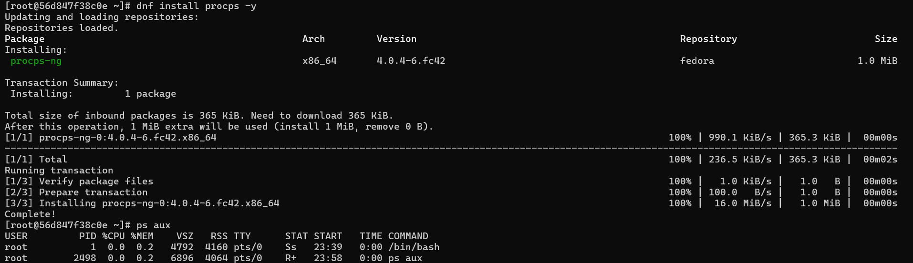

* Instalando o `ps` com o comando `dnf install procps -y` para uso no processo de execução e verificando processo em execução com o comando `ps aux`.

 

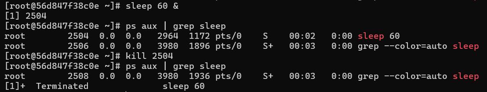

* Na primeira linha do `bash` contem o comando que executa um processo de timer 60 segundos `sleep 60 &`. A resposta é o número de processo em background `[1]` e o ID do processo `PID` `2504`.
* Na segunda linha do `bash` contem o comando para listar os processos sleeps em andamento `ps aux | grep sleep`.
* Na terceira e na quarta linha do `bash` contêm os comandos para encerrar o processo aberto anteriormente `kill 2504` e em seguinda verificando a lista de processos novamente `ps aux | grep sleep`.

 

## Etapa 6 - Encerrando Container

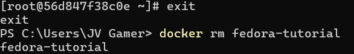

* Saindo do container usando o comando `exit` e removendo o container com `docker rm fedora-tutorial`.

## Conclusão

> Atráves da atividade realizada foi possivel adiquiri conhecimento sobre o funcionamento e a sintaxe usada em um terminal Linux de uma máquina. Além disso, foi possivel ver a alta verbosidade em quantidade e em complexidade de comandos usados em comparação a outros sistemas operacionais como Windows. Ademais foi satisfatorio o conhecimento adquirido por meio da atividade de introdução a Linux usando Container Docker baseado em Fedora Linux.